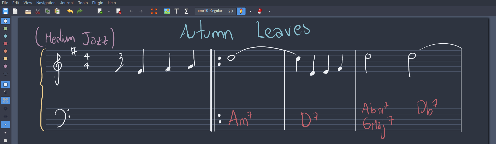

# xournalpp-nord
A nord theme for Xournal++. This repo contains both dark and light themes
for Xournal++.

## Installation

Download the file `toolbar.ini` and add it's contents to your
`toolbar.ini`, which can be found in one of the following directories
depending on your Linux distribution:

* `$HOME/.xournalpp`
* `$HOME/.config/xournalpp`
* `$HOME/.config/com.github.xournalpp.xournalpp`

## Activation and usage

In Xournal++, navigate to *View -> Toolbars* and choose `Nord_light` or `Nord_dark`.

To configure the background color navigate to *Journal -> Configure Page*
and set the background color to `#eceff4` if you want the light theme or
`#2e3440` for the dark theme.

If you want to use ruled paper or any non-blank page style in dark theme,
I would recommend using the pdf backgrounds provided in this repo, to do
this, download the files located in the Backgrounds directory of this repo,
navigate to *File -> Annotate PDF* and select your prefered background.

